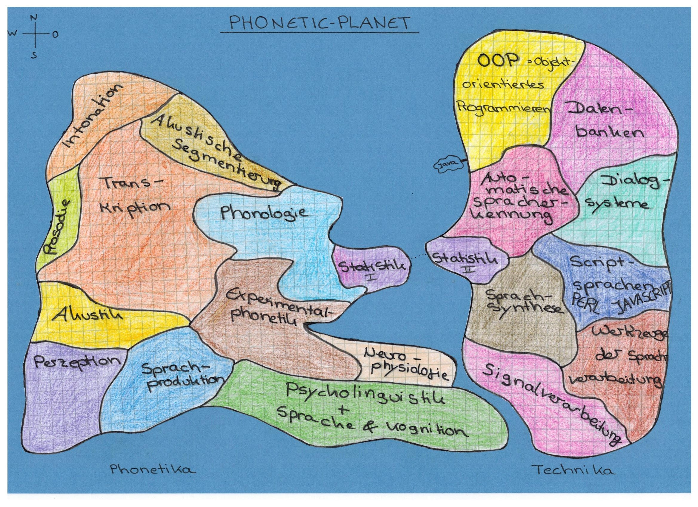
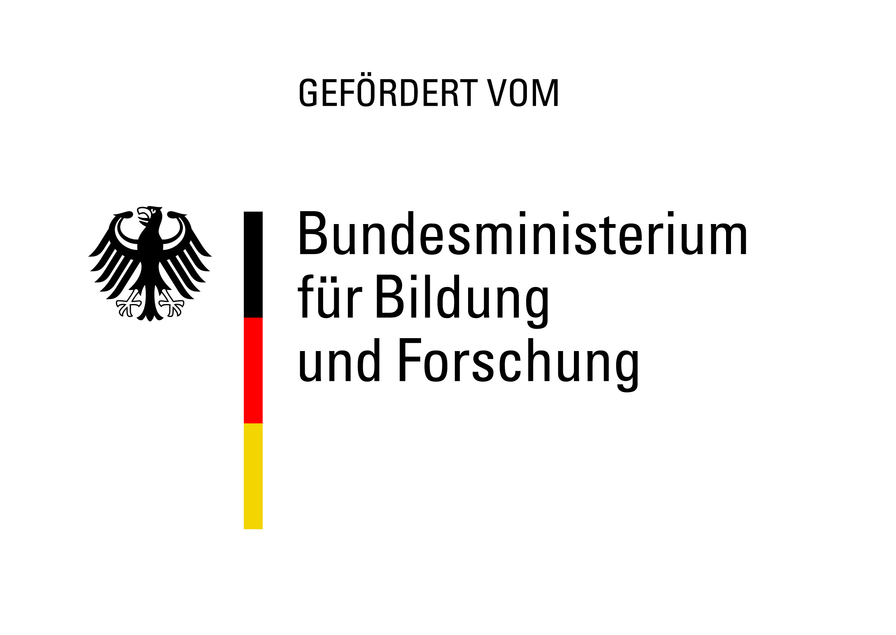
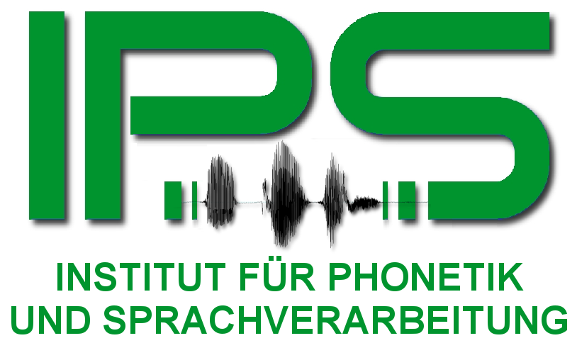
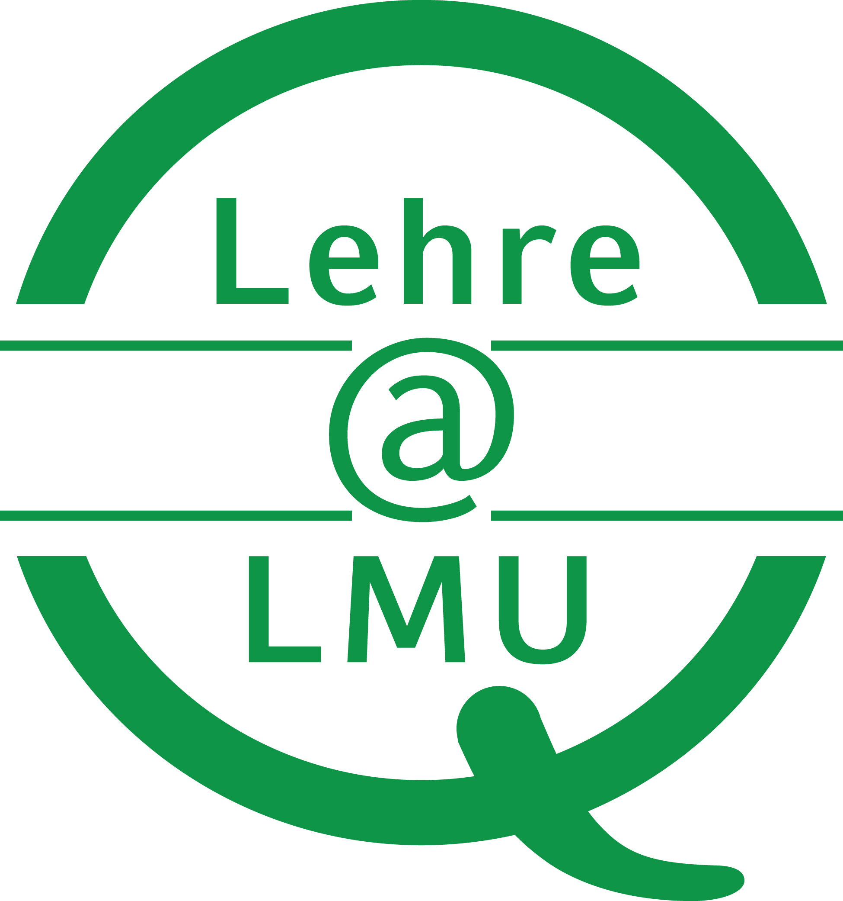

-----

**
Logbuch Phonetik und Sprachverarbeitung
**

**
P1.3 Deskriptive Phonetik 2018/19
**

-----

Felicitas Kleber, Florian Schiel, Raphael Winkelmann, Christoph Draxler,
Anke Werani, Nikola Anna Eger, Markus Jochim

	
	
	
	

Dieses Teilprojekt wird im Rahmen des
Multiplikatoren-Projekts durch den Qualitätspakt Lehre (Lehre@LMU)
gefördert. Das Multiplikatoren-Projekt ist an das LMU Center for
Leadership and People Management angegliedert. Der Qualitätspakt Lehre
wird aus Mitteln des Bundesministeriums für Bildung und Forschung unter
dem Förderkennzeichen 01PL12016 gefördert. Die Verantwortung für den
Inhalt dieser Veröffentlichung liegt beim Autor.
